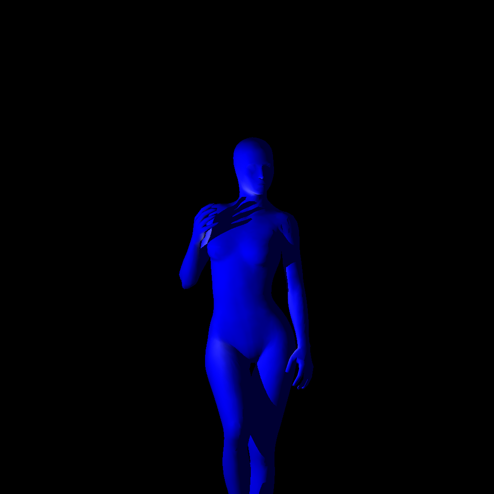

# SwiftRayTracer

A simple ray-tracer in Phong shading model

## Implementation

A wavefront(obj) file with vertexes and faces (triangles) is read.

Grand Central Dispatch is used for parallelism.

A PNG or PMM picture is generated by ray tracing.

## Parameters

### Global

width, height: Int

light, lightColor: Vector

### In Loop

ray: Ray

ambient = 0.2, diffuse = 0.8, specular = 0.3, reflection = 0.8

## Result

### 1024x1024

1min on MacBook Pro (Retina, 15-inch, Mid 2012)

### 4096x4096

15min on MacBook Pro (Retina, 15-inch, Mid 2012)
